# Interstella: CICD for Containers on AWS

## Overview
Welcome to the Interstella Galactic Trading Co team!  Interstella Galactic Trading Co is an intergalactic trading company that deals in rare resources.  Business is booming, but we're struggling to keep up with orders mainly due to our legacy logistics platform.  We heard about the benefits of containers, especially in the context of microservices and devops. We've already taken some steps in that direction, but can you help us take this to the next level? 

We've already moved to a microservice based model, but are still not able to develop quickly. We want to be able to deploy to our microservices as quickly as possible while maintaining a certain level of confidence that our code will work well. This is where you come in.

If you are not familiar with DevOps, there are multiple facets to the the word. One focuses on organizational values, such as small, well rounded agile teams focusing on owning a particular service, whereas one focuses on automating the software delivery process as much as possible to shorten the time between code check in and customers testing and providing feedback. This allows us to shorten the feedback loop and iterate based on customer requirements at a much quicker rate. 

In this workshop, you will take Interstella's existing logistics platform and apply concepts of CI/CD to their environment. To do this, you will create a pipeline to automate all deployments using AWS CodeCommit or GitHub, AWS CodeBuild, AWS CodePipeline, and AWS CloudFormation. Today, the Interstella logistic platform runs on Amazon Elastic Container Service following a microservice architecture, meaning that there are very strict API contracts that are in place. As part of the move to a more continuous delivery model, they would like to make sure these contracts are always maintained.

The tools that we use in this workshop are part of the AWS Dev Tools stack, but are by no means an end all be all. What you should focus on is the idea of CI/CD and how you can apply it to your environments.

### Requirements:
* AWS account - if you don't have one, it's easy and free to [create one](https://aws.amazon.com/)
* AWS IAM account with elevated privileges allowing you to interact with CloudFormation, IAM, EC2, ECS, ECR, ALB, VPC, SNS, CloudWatch, AWS CodeCommit, AWS CodeBuild, AWS CodePipeline
* Familiarity with Python, vim/emacs/nano, [Docker](https://www.docker.com/), AWS and microservices - not required but a bonus

### What you'll do:

These labs are designed to be completed in sequence, and the full set of instructions are documented below.  Read and follow along to complete the labs.  If you're at a live AWS event, the workshop attendants will give you a high level run down of the labs and help answer any questions.  Don't worry if you get stuck, we provide hints along the way.  

* **Workshop Setup:** Setup working environment on AWS  
* **Lab 0:** Deploy fulfillment monolith service manually
* **Lab 1:** Break apart monolith repo, automate builds
* **Lab 2:** Automate end to end deployment
* **Lab 3:** Build tests into deployment pipeline
* **Bonus Lab:** Build governance into pipeline - Black days
* **Workshop Cleanup** [Cleanup working environment](#workshop-cleanup)

### Conventions:
Throughout this workshop, we will provide commands for you to run in the terminal.  These commands will look like this:

<pre>
$ ssh -i <b><i>PRIVATE_KEY.PEM</i></b> ec2-user@<b><i>EC2_PUBLIC_DNS_NAME</i></b>
</pre>

The command starts after the $.  Text that is ***UPPER_ITALIC_BOLD*** indicates a value that is unique to your environment.  For example, the ***PRIVATE\_KEY.PEM*** refers to the private key of an SSH key pair that you've created, and the ***EC2\_PUBLIC\_DNS\_NAME*** is a value that is specific to an EC2 instance launched in your account.  You can find these unique values either in the CloudFormation outputs or by going to the specific service dashboard in the [AWS management console](https://console.aws.amazon.com).

If you are asked to enter a specific value in a text field, the value will look like `VALUE`.

Hints are also provided along the way and will look like this:

HINT

**Nice work, you just revealed a hint!**

*Click on the arrow to show the contents of the hint.*

### IMPORTANT: Workshop Cleanup

You will be deploying infrastructure on AWS which will have an associated cost. If you're attending an AWS event, credits will be provided.  When you're done with the workshop, [follow the steps at the very end of the instructions](#workshop-cleanup) to make sure everything is cleaned up and avoid unnecessary charges.

* * *

## Let's Begin!

### Workshop Setup

1\. Log into the AWS Management Console and select an [AWS region](http://docs.aws.amazon.com/AWSEC2/latest/UserGuide/using-regions-availability-zones.html).  

The region dropdown is in the upper right hand corner of the console to the left of the Support dropdown menu.  For this workshop, choose **EU (Ireland)** or **US East (Ohio)**.  Workshop administrators will typically indicate which region you should use.

2\. Generate a Fulfillment API Key to authorize the logistics platform to communicate with the fulfillment API.

Open the [Interstella API Key Portal](http://www.interstella.trade/getkey.html) in a new tab and click on **Sign up Here** to create a new account.  Enter a username and password and click **Sign up**.  Note and save your login information because you will use this page again later in the workshop.  Click **Sign in**, enter your login information and click **Login**.

Note down the unique API key that is generated.

For example:

3\. Launch the [CloudFormation](http://docs.aws.amazon.com/AWSCloudFormation/latest/UserGuide/Welcome.html) template for your selected region to stand up the core workshop infrastructure.

Here is what the workshop environment looks like:

The CloudFormation template will launch the following:
* VPC with public subnets, routes and Internet Gateway
* EC2 Instances with security groups (inbound tcp 22, 80, 5000) and joined to an ECS cluster 
* ECR repositories for your container images
* Application Load Balancer to front all your services
* Parameter store to hold values for your API Key, Order Fulfillment URL, SNS Topic ARNs to subscribe to, and a security SNS topic.
* Cloud9 Development Environment

*Note: SNS Orders topic, S3 assets, API Gateway and DynamoDB tables are admin components that run in the workshop administrator's account.  If you're at a live AWS event, this will be provided by the workshop facilitators.  We're working on packaging up the admin components in an admin CloudFormation template, so you will be able to run this workshop at your office or home.*

Open the CloudFormation launch template link below for the region you selected in Step 1 in a new tab.  The link will load the CloudFormation Dashboard and start the stack creation process in the chosen region.

Region | Launch Template
------------ | -------------  
**Ireland** (eu-west-1) |   
**Ohio** (us-east-2) |  

The link above will bring you to the AWS CloudFormation console with the **Specify an Amazon S3 template URL** field populated and radio button selected. Just click **Next**. If you do not have this populated, please click the link above.

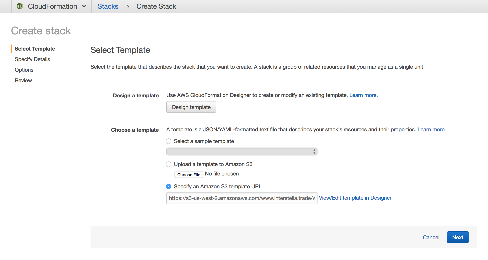

4\. On the Specify Details page, there are some parameters to populate. Feel free to leave any of the pre-populated fields as is. The only fields you **NEED** to change are:

- **EnvironmentName** - *This name will be prepended to many of the resources created to help you distinguish the workshop resources from other existing ones*

*Important: please use only lowercase letters. The ECR repository leverages this CloudFormation parameter and ECR repository names can only contain lower case letters.*

- **InterstellaApiKey** - *In a previous step, you visited the getkey website to get an API key for fulfillment. Enter it here.*

Click **Next** to continue.

5\. No changes or inputs are required on the Options page.  Click **Next** to move on to the Review page.

6\. Acknowledge that CloudFormation will create IAM resources and create the stack.

On the Review page, take a look at all the parameters and make sure they're accurate. Check the box next to **I acknowledge that AWS CloudFormation might create IAM resources with custom names.** If you do not check this box, the stack creation will fail. As part of the cleanup, CloudFormation will remove the IAM Roles for you.

Click **Create** to launch the CloudFormation stack.

### Checkpoint:
The CloudFormation stack will take a few minutes to launch.  Periodically check on the stack creation process in the CloudFormation Dashboard.  Your stack should show status **CREATE\_COMPLETE** in roughly 5-10 minutes. If you select box next to your stack and click on the **Events** tab, you can see what steps it's on.  

If there was an [error](http://docs.aws.amazon.com/AWSCloudFormation/latest/UserGuide/troubleshooting.html#troubleshooting-errors) during the stack creation process, CloudFormation will rollback and terminate. You can investigate and troubleshoot by looking in the Events tab.  Any errors encountered during stack creation will appear in the event stream as a failure.

While you're waiting, take a minute to look over the overall architecture that you will be deploying to:

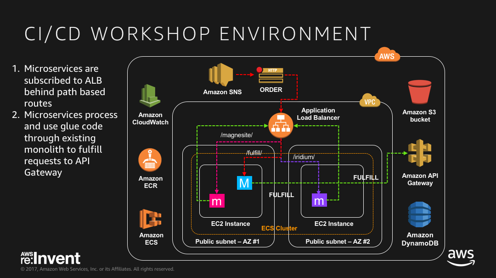

### Lab 0 - Manually deploy monolith service

In this lab, you will manually deploy the monolith service so that you know what you'll be automating later. If you are new to the Interstella workshop series, the monolith is what we broke apart into microservices using the strangler pattern. There's still some legacy order fulfillment code in there that we can't get rid of, which is what you'll be deploying now. For a better sense of the story, review [Interstella GTC: Monolith to Microservices with Containers](https://github.com/aws-samples/amazon-ecs-interstella-workshop/tree/master/workshop-microservices). By the end of the lab, you will have a single monolith service waiting to fulfill orders to the API.

Here's a reference architecture for what you'll be building:

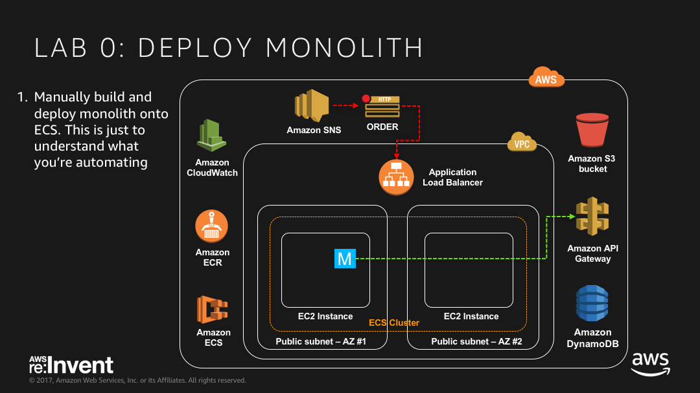

*Reminder: You'll see SNS topics, S3 bucket, API Gateway and DynamoDB in the diagram.  These are provided by Interstella HQ for communicating orders and fulfilling orders.  They're in the diagram to show you the big picture as to how orders come in to the logistics platform and how orders get fulfilled*

1\. Access your AWS Cloud9 Development Environment.

In the AWS Management Console, go to the [Cloud9 Dashboard](https://console.aws.amazon.com/cloud9/home) and find your environment which should be prefixed with the **EnvironmentName** specifed in the CloudFomation template. You can also find the name of your environment in the CloudFormation outputs as Cloud9EnvName. Click **Open IDE**.

2\. Familiarize yourself with the Cloud9 Environment.

On the left pane (Blue), any files downloaded to your environment will appear here in the file tree. In the middle (Red) pane, any documents you open will show up here. Test this out by double clicking on README.md in the left pane and edit the file by adding some arbitrary text. Then save it by clicking **File** and **Save**. Keyboard shortcuts will work as well.

On the bottom, you will see a bash shell (Yellow). For the remainder of the lab, use this shell to enter all commands.  You can also customize your Cloud9 environment by changing themes, moving panes around, etc.

3\. Download the monolith service source, requirements file, and [Dockerfile](https://docs.docker.com/engine/reference/builder/) from Interstella HQ. We'll also take this opportunity to install the [ECR Credential Helper](https://github.com/awslabs/amazon-ecr-credential-helper) to help with authentication (don't worry, we'll explain later). Once logged onto the instance, copy down required files for the monolith (glue fulfillment) service

<pre>
$ aws s3 sync s3://www.interstella.trade/code/cicd/monolith/ monolith/
$ cd monolith
$ chmod +x installcredhelper.sh
$ sudo ./installcredhelper.sh
</pre>

*Note: This is using the [AWS CLI](https://aws.amazon.com/cli/) which comes bundled with Cloud9, and we authorize access to S3 through [AWS Managed Temporary Credentials](https://docs.aws.amazon.com/cloud9/latest/user-guide/auth-and-access-control.html#auth-and-access-control-temporary-managed-credentials). Also notice the downloaded files appeared in your Cloud9 file tree.*

4\. Build the monolith docker image and push to ECR.

First, we have to get the ECR repository that we will be pushing to. Navigate to [Repositories](https://console.aws.amazon.com/ecs/home#/repositories) in the ECS dashboard. You should see a few repositories that were created for you:

Click on the monolith repo and note down the "Repository URI".

Go back in your Cloud 9 IDE and build the monolith docker image (you should still be in the monolith directory) using the following command:

<pre>
$ docker build -t monolith .
</pre>

*You'll see some red error-looking messages during the build process. Don't worry about them*

Try to run the image with the command below, and you should see output like this:

<pre>
$ docker run -it monolith
INFO:botocore.vendored.requests.packages.urllib3.connectionpool:Starting new HTTP connection (1): 169.254.169.254
INFO:botocore.vendored.requests.packages.urllib3.connectionpool:Starting new HTTP connection (1): 169.254.169.254
INFO:botocore.vendored.requests.packages.urllib3.connectionpool:Starting new HTTPS connection (1): ssm.eu-central-1.amazonaws.com
INFO:werkzeug: * Running on http://0.0.0.0:5000/ (Press CTRL+C to quit)
INFO:werkzeug: * Restarting with stat
INFO:botocore.vendored.requests.packages.urllib3.connectionpool:Starting new HTTP connection (1): 169.254.169.254
INFO:botocore.vendored.requests.packages.urllib3.connectionpool:Starting new HTTP connection (1): 169.254.169.254
INFO:botocore.vendored.requests.packages.urllib3.connectionpool:Starting new HTTPS connection (1): ssm.eu-central-1.amazonaws.com
WARNING:werkzeug: * Debugger is active!
INFO:werkzeug: * Debugger PIN: 896-977-731
</pre>

Push **Ctrl + C** to exit.

Once you've confirmed it runs, tag and push your container image to the repository URI you noted down earlier:

<pre>
$ docker tag monolith:latest <b><i>ECR_REPOSITORY_URI</i></b>:latest
$ docker push <b><i>ECR_REPOSITORY_URI</i></b>:latest
</pre>

When you issue the push command, Docker pushes the layers up to ECR, and if you refresh the monolith repository page, you'll see an image indicating the latest version.  

*Note: You did not need to authenticate docker with ECR because of the [Amazon ECR Credential Helper](https://github.com/awslabs/amazon-ecr-credential-helper). You can read more about the credentials helper in this blog article - https://aws.amazon.com/blogs/compute/authenticating-amazon-ecr-repositories-for-docker-cli-with-credential-helper/*

5\. Create a task definition to reference this Docker image in ECS and enable logging to CloudWatch Logs.

Now that we've pushed an image to ECR, let's make a task definition to reference and deploy using ECS. In the AWS Management Console, navigate to [Task Definitions](https://console.aws.amazon.com/ecs/home#/taskDefinitions) in the ECS dashboard. Click on **Create new Task Definition**. 

If you are in a region that supports both [Fargate and EC2 launch types](https://docs.aws.amazon.com/AmazonECS/latest/developerguide/launch_types.html), select **EC2** launch type compatibility and click **Next step**.

Enter a name for your task definition, e.g. `interstella-monolith`.

Scroll down to "Container Definitions" and click **Add container**.  

Enter values for the following fields:

- **Container name** - this is a friendly name for your container, not the name of the container image. e.g. `interstella-monolith`
- **Image** - this is a reference to the container image stored in ECR.  The format should be the same value you used to push the container to ECR - <pre><b><i>ECR_REPOSITORY_URI</i></b>:latest</pre>
- **Memory Limits** - select **Soft limit** from the drop down, and enter `128`.
- **Port Mappings** - Host Port: **0** Container Port: **5000**

Your container definition should look like this:

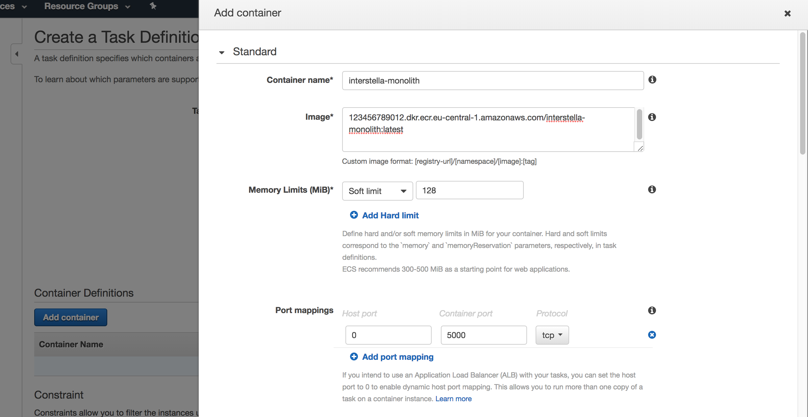

In the "Advanced container configuration" section, scroll down until you get to the "Storage and Logging" section where you'll find **Log Configuration**.

Select **awslogs** from the *Log driver* dropdown.

For *Log options*, enter values for the following:

* **awslogs-group** - enter the name of the CloudWatch log group that CloudFormation created, e.g. `[EnvironmentName]-LogGroup`

*IMPORTANT: Replace `[EnvironmentName]` above with the EnvironmentName you specified when you created the CloudFormation stack. For example, if your EnvironmentName was "interstella", the log group would be "interstella-LogGroup". The CloudWatch Logs group is one of the outputs returned from running the interstella CloudFormation stack, so you can always go there to dig up the value.*

* **awslogs-region** - enter the AWS region of the log group (i.e.: the current region you're working in); the expected value is the region code.

HINT: Region codes

US East (N.Virginia) = us-east-1 
US East (Ohio) = us-east-2 
US West (Oregon) = us-west-2 
EU (Ireland) = eu-west-1 

For example, if you ran the CloudFormation stack in Ireland, you would enter 'eu-west-1' for the awslogs-region.

* **awslogs-stream-prefix** - enter `prod`

The log configuration should look something like this:

Click **Add** and then **Create**.

6\. Create an ECS Service using your task definition.

It's time to start up the monolith service. Let's create an ECS service. What's a service you ask? There are two ways of launching Docker containers with ECS. One is to create a service and the other is to run a task.

**Services** are for long running containers. ECS will make sure that they are always up for you. Great for things like apache/webservers.

**Tasks**, however, are short lived, possibly periodic. Run once and that's it. ECS will not try to bring up new containers if it goes down.

From the Task Definition page, click on **Actions** and choose **Create Service**. If you navigated away from the page, go to [Task Definitions](https://console.aws.amazon.com/ecs/home#/taskDefinitions) in the ECS dashboard.

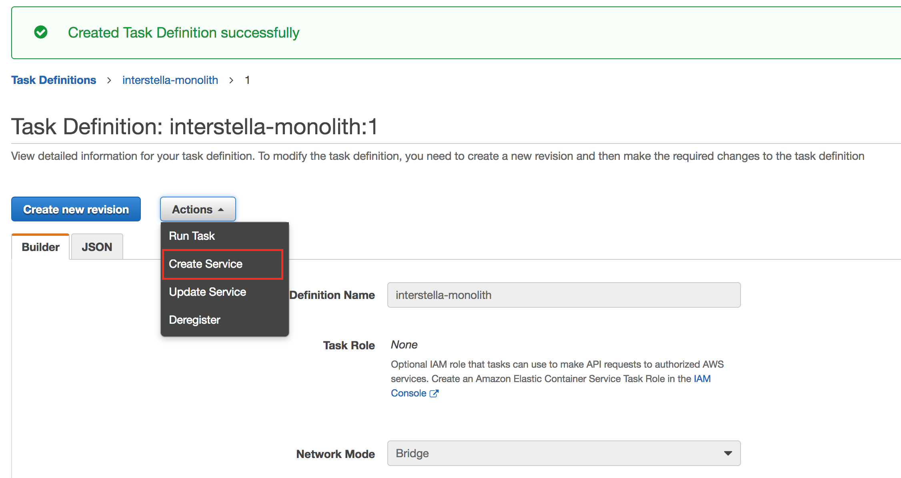

Fill in the following fields:

* **Cluster** - select your ECS cluster from the dropdown menu, e.g. interstella
* **Service Name** - enter a name for your service, e.g. `interstella-monolith`
* **Number of tasks** - enter `1` for now; you will horizontally scale this service in the last lab with a new ECS service

*Note: If you're in a region that supports Fargate launch type, you may see a field named "Launch Type". This workshop uses the EC2 launch type, so select **EC2**.*

*Note: There are many options to explore in the Task Placement section of the Run Task action, and while we will not touch on every configuration in this workshop, you can read more about [Scheduling Tasks](http://docs.aws.amazon.com/AmazonECS/latest/developerguide/scheduling_tasks.html) in our documentation.*

Leave the other fields as default and click **Next step**

7\. Associate an ALB with your ECS Service.

On the next page, select **Application Load Balancer** for **Load balancer type**. Then select the Service IAM Role created by CloudFormation. It should start with your environmentName. In my case, it is **interstella-ECSServiceRole**.

You'll see a **Load balancer name** drop-down menu appear.  Select the ALB that was created by CloudFormation. It should start with your environmentName, e.g. **interstella-LoadBalancer**.

In the "Container to load balance" section, click **Add to load balancer**. Configure the following values:

- Listener port: **80** *This is a dropdown. Choose 80:HTTP.*
- Target Group: Look for the one that has "monolith" in the name.

Leave the rest as default as you can't edit it and click **Next**.

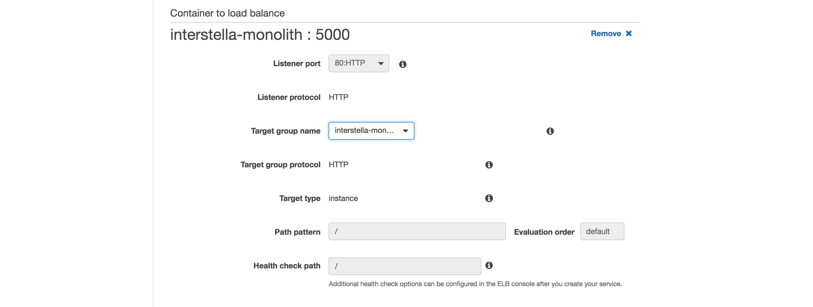

8\. Click **Next step** to skip the auto scaling option.  

Click **Create Service** and click **View Service** to get the status of your service launch. The *Last Status* will show **RUNNING** once your container has launched.

9\. Confirm logging to CloudWatch Logs is working.

Once the monolith service is running, navigate to the [CloudWatch dashboard](https://console.aws.amazon.com/cloudwatch/home), click **Logs** on the left menu, and then select the log groug which should look like **EnvironmentName-LogGroup** (*replacing EnvironmentName with the one you used*).  As your container processes orders, you'll see a log stream appear in the log group reflecting HTTP health checks from the ALB as well as all the requests going in. Open the most recent one. You can test the monolith fulfillment service by sending some data to it using curl from your Cloud9 IDE:

<pre>
$ curl <b><i>LoadBalancerDNSName</i></b>/fulfill/ -d '{"iridium":"1"}'
</pre>

*Note: You'll need to provide your ALB DNS name which you can find in the CloudFormation outputs identified as "LoadBalancerDNSName".*

Here's an example of running the curl command and the output you should see:

<pre>
$ curl interstella-LoadBalancer-972770484.eu-central-1.elb.amazonaws.com/fulfill/ -d '{"iridium":"1"}'
Your fulfillment request has been delivered
</pre>

In the log stream you were looking at just a few minutes ago, you should see a lot of HTTP GETs. Those are health checks from the ALB.

Somewhere within the log stream, you should see these log statements:
<pre>
Trying to send a request to the API
API Status Code: 200
Fulfillment request succeeded
</pre>

### Checkpoint
At this point, you've manually deployed a service to ECS. It works, and is going to act as the glue code that connects our microservices together. Now let's automate it!

### Lab 1 - Offload the application build from your dev machine

In this lab, you will start the process of automating the entire software delivery process. The first step we're going to take is to automate the Docker container builds and push the container image into the Elastic Container Registry. This will allow you to develop and not have to worry too much about build resources. We will use AWS CodeCommit and AWS CodeBuild to automate this process.

We've already separated out the microservices code in the application, but it's time to move the code out of the monolith repo so we can work on it independently and iterate on it quicker. As part of the bootstrap process, CloudFormation has already created an AWS CodeCommit repository for you. It will be called EnvironmentName-iridium-repo (*replacing EnvironmentName with the one you specified when running the CloudFormation template*). We'll use this repository to break apart the iridium microservice code from the monolith.

Here's a reference architecture for what you'll be building:

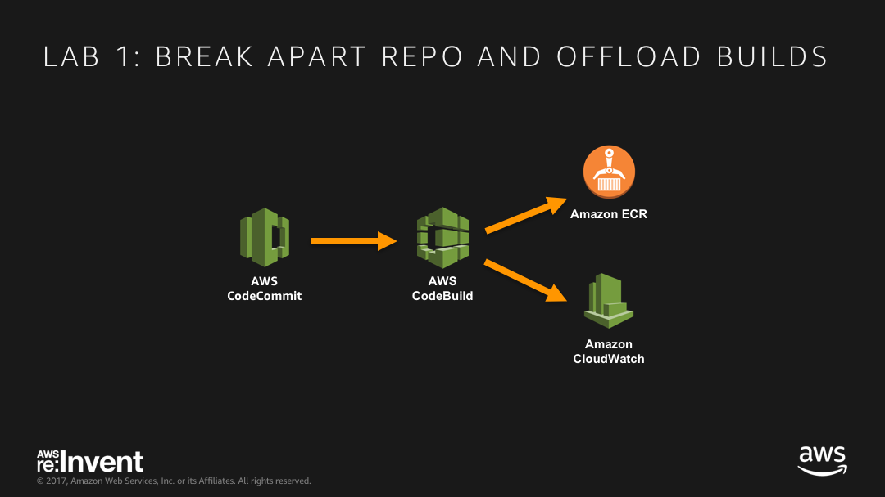

1\. Create and configure an AWS CodeBuild Project.

*You may be thinking, why would I want this to automate when I could just do it on my local machine. Well, this is going to be part of your full production pipeline. We'll use the same build system process as you will for production deployments. In the event that something is different on your local machine as it is within the full dev/prod pipeline, this will catch the issue earlier. You can read more about this by looking into **Shift Left**.*

In the AWS Management Console, navigate to the [AWS CodeBuild dashboard](https://console.aws.amazon.com/codebuild/home). You'll see some CodeBuild projects there already created by CloudFormation. Disregard them as they're for later. Click on **Create Project**.

On the **Configure your project** page, enter in the following details:

- Project Name: Enter `dev-iridium-service`
- Source Provider: Select **AWS CodeCommit**
- Repository: Select the CodeCommit repository that was created by CloudFormation, e.g. interstella-iridium-repo

Environment:

- Environment Image: Select **Use an Image managed by AWS CodeBuild** - *There are two options. You can either use a predefined Docker container that is curated by CodeBuild, or you can upload your own if you want to customize dependencies etc. to speed up build time*
- Operating System: Select **Ubuntu** - *This is the OS that will run your build*
- Runtime: Select **Docker** - *Each image has specific versions of software installed. See [Docker Images Provided by AWS CodeBuild](http://docs.aws.amazon.com/codebuild/latest/userguide/build-env-ref-available.html)*
- Runtime version: Select **aws/codebuild/docker:17.09.0** - *This will default to the latest*
- Build Specification: Select **Use the buildspec.yml in the source code root directory**
- Buildspec name: Enter `buildspec.yml` *if not already populated*

Your progress should look similar to this (note the runtime version may differ which is ok):

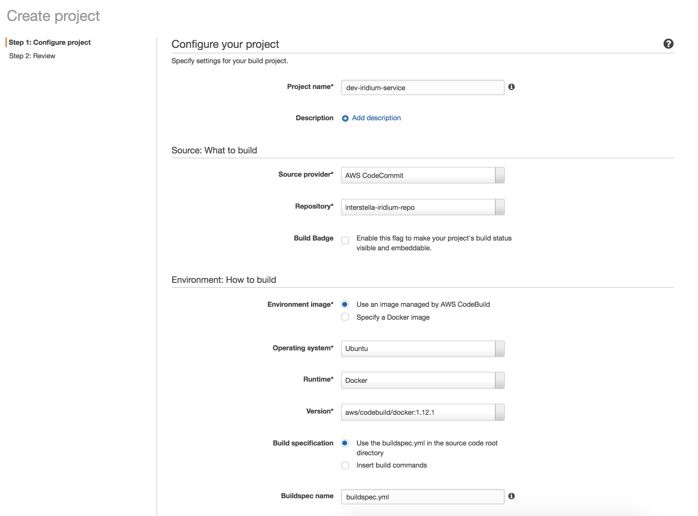

Artifacts:

- Type: Select **No artifacts** *If there are any build outputs that need to be stored, you can choose to put them in S3.*

Cache: 

- Type: Select **No Cache** *There are no dependencies to cache, so we're not using the caching mechanism. CodeBuild does not yet cache Docker layers.*

Service Role:

- Service Role: Select **Create a service role in your account**
- Role Name: **codebuild-dev-iridium-service-service-role** *This is pre-populated and CodeBuild will assume this role to build your application*

VPC:

- VPC: Select **No VPC** *If you have private repos you need to access that are hosted within your VPC, choose a VPC here. In this lab we don't have anything like that*

Expand the **Advanced** settings section and under "Environment variables", enter two environment variables:

- Name: `AWS_ACCOUNT_ID` Value: ***Your account ID*** Type: **Plaintext** *You can find your account number [here](https://console.aws.amazon.com/billing/home?#/account)*
- Name: `IMAGE_REPO_NAME` Value: ***Name of the iridium ECR repo*** Type: **Plaintext** *This is the name of your ECR repo for iridium which follows this format - EnvironmentName-iridium; you can also find the repository name in the [Repositories](https://console.aws.amazon.com/ecs/home#/repositories) section of the ECS dashboard*

Click **Continue**, and then **Save**.

When you click save, CodeBuild will create an IAM role to access other AWS resources to complete your build. By default, it doesn't include everything, so we will need to modify the newly created IAM Role to allow access to Elastic Container Registry (ECR). 

2\. Modify IAM role to allow CodeBuild to access other resources like ECR.

In the AWS Management Console, navigate to the [AWS IAM console](https://console.aws.amazon.com/iam/). Choose **Roles** on the left. Find the role that created earlier. In the example, the name of the role created was **codebuild-dev-iridium-service-service-role**. Click **Add inline policy**. By adding an inline policy, we can keep the existing managed policy separate from what we want to manage ourselves. 

Choose **Custom Policy**. Name it **AccessECR** and enter in:

<pre>
{
    "Version": "2012-10-17",
    "Statement": [
        {
            "Action": [
                "ecr:BatchCheckLayerAvailability",
                "ecr:CompleteLayerUpload",
                "ecr:GetAuthorizationToken",
                "ecr:InitiateLayerUpload",
                "ecr:PutImage",
                "ecr:UploadLayerPart"
            ],
            "Resource": "*",
            "Effect": "Allow"
        }
    ]
}

</pre>

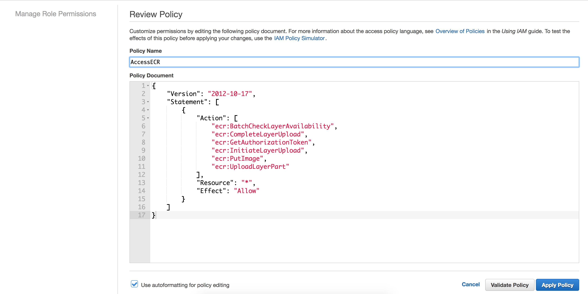

Choose **Apply Policy**

3\. Get details about the iridium ECR repository where we will be pushing and pulling Docker images to/from.

We now have the building blocks in place to start automating the builds of our Docker images. Now it's time to figure out how to use the Amazon Elastic Container Registry.

In the AWS Management Console, navigate to [Repositories](https://console.aws.amazon.com/ecs/home#/repositories) in the ECS dashboard. Click on the repository with "iridium" in the name.

Click on "View Push Commands" and copy the login, build, tag, and push commands to use later.

4\. Connect to your AWS CodeCommit repository.

In the AWS Management Console, navigate to the [AWS CodeCommit](https://console.aws.amazon.com/codecommit/home#) dashboard. Choose the repository named **EnvironmentName-iridium-repo** where *EnvironmentName* is what you entered in CloudFormation. A screen should appear saying **Connect to your repository**.
*Note: If you are familiar with using git, feel free to use the ssh connection as well.*

When the **Connect to your repository** screen appears, choose **HTTPS** for the connection type to make things simpler for this lab.

In the "Steps to clone your repository" section, click on the **IAM User** link. This will launch the IAM dashboard in a new tab, so you can generate credentials for to log into CodeCommit when trying to check your code in.

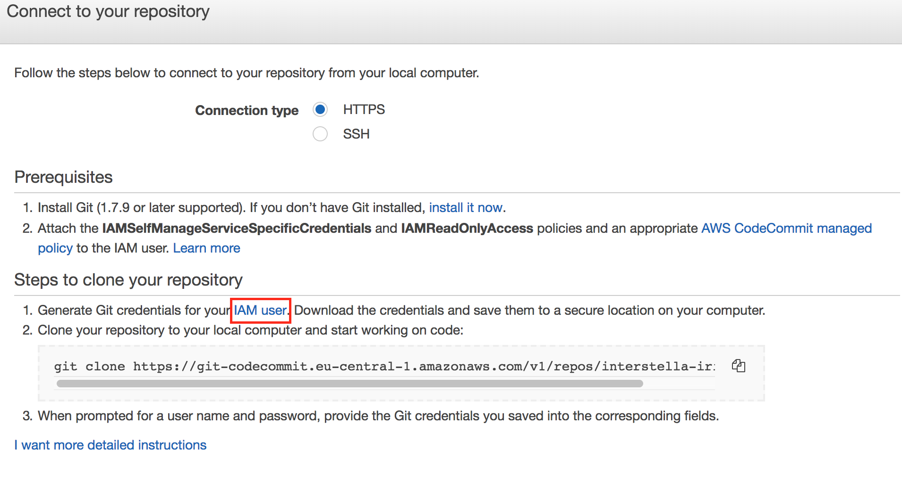

Scroll down to the **HTTPS Git credentials for AWS CodeCommit** section and click on **Generate**. CodeCommit uses default git authentication instead of IAM roles, so we need to create git credentials to access your repository.

Save the **User name** and **Password** as you'll never be able to get this again. Close the IAM tab and return to the [CodeCommit](https://console.aws.amazon.com/codecommit/home#) dashboard.

Note down the "git clone" command in step 2, which you'll use in the next step.

5\. In your Cloud9 IDE, download the microservice code and commit one microservice to your CodeCommit repo

Before we log into CodeCommit, to avoid entering in a password every time, we're going to cache the password. Run the following command to cache the password for the next two hours. While we're at it, we'll also set up a git name and email:

<pre>
$ git config --global credential.helper "cache --timeout=7200"
$ git config --global user.email "<b><i>REPLACEWITHYOUREMAIL</i></b>"
$ git config --global user.name "<b><i>REPLACEWITHYOURNAME</i></b>"
</pre>

Run the git clone command you noted down above to clone the empty repository.

Here's an example (note your codecommit path will be unique):
<pre>
$ cd ~/environment/
$ git clone https://git-codecommit.us-east-2.amazonaws.com/v1/repos/interstella-iridium-repo
</pre>

You'll be prompted for your CodeCommit username and password (Note: this was generated earlier in the IAM dashboard), enter them here.  

Once you've cloned the empty repository, let's download some files from Interstella HQ. First, navigate to the directory created by the clone command; then use the AWS sync command to pull files from Interstella HQ's S3 bucket.

<pre>
$ cd <i><b>EnvironmentName</b></i>-iridium-repo
$ aws s3 sync s3://www.interstella.trade/code/cicd/iridium .
$ aws s3 sync s3://www.interstella.trade/hints/cicd hints/
$ aws s3 sync s3://www.interstella.trade/tests/cicd tests/
</pre>

You are now separating one part of the repository into another so that you can commit directly to the specific service. Similar to breaking up the monolith application in [Interstella GTC: Monolith to Microservices with Containers](https://github.com/aws-samples/amazon-ecs-interstella-workshop/tree/master/workshop-microservices), we've now started to break the monolithic repository apart.

You should still be in the iridium folder. Run the following commands to create a dev branch:

<pre>
$ git checkout -b dev
$ git add -A
$ git commit -m "Splitting iridium service into its own repo"
$ git push origin dev
</pre>

If you go back to your repo in the AWS CodeCommit dashboard, you should now be able to look at the code you just committed.

6\. Next you need to instruct AWS CodeBuild on what to do.

AWS CodeBuild uses a definition file called a buildspec Yaml file. The contents of the buildspec will determine what AWS actions CodeBuild should perform. The key parts of the buildspec are Environment Variables, Phases, and Artifacts. See [Build Specification Reference for AWS CodeBuild](http://docs.aws.amazon.com/codebuild/latest/userguide/build-spec-ref.html) for more details.

**At Interstella, we want to follow best practices, so there are 2 requirements:**

1. We don't use the ***latest*** tag for Docker images. We have decided to use the Commit ID from our source control instead as the tag so we know exactly what image was deployed.

2. We want this buildspec to be generalized to multiple environments but use different CodeBuild projects to build our Docker containers. You have to figure out how to do this.

Another developer from the Interstella team has started a buildspec file for you, but never got to finishing it. Add the remaining instructions to the buildspec.yml.draft file. The file should be in your EnvironmentName-iridium-repo folder and already checked in. Copy the draft to a buildspec.yml file.

<pre>
$ cp buildspec.yml.draft buildspec.yml
</pre>

Now that you have a copy of the draft as your buildspec, you can start editing it. The previous developer left comments indicating what commands you need to add (*These comments look like - #[TODO]:*). Add the remaining instructions to your buildspec.yml.  

Here are links to documentation and hints to help along the way. If you get stuck, look at the [hintspec.yml](hints/hintspec.yml) file in the hints folder:

*#[TODO]: Command to log into ECR. Remember, it has to be executed $(maybe like this?)*

* http://docs.aws.amazon.com/AmazonECR/latest/userguide/Registries.html
* https://docs.aws.amazon.com/codebuild/latest/userguide/sample-docker.html#sample-docker-files

*#[TODO]: Build the actual image using the current commit ID as the tag...perhaps there's a CodeBuild environment variable we can use. Remember that we also added two custom environment variables into the CodeBuild project previously: AWS_ACCOUNT_ID and IMAGE_REPO_NAME. How can you use them too?*

* https://docs.docker.com/get-started/part2/#build-the-app
* http://docs.aws.amazon.com/codebuild/latest/userguide/build-env-ref-env-vars.html

*#[TODO]: Tag the newly built Docker image so that we can push the image to ECR. See the instructions in your ECR console to find out how to do this. Make sure you use the current commit ID as the tag!*

*#[TODO]: Push the Docker image up to ECR*

* http://docs.aws.amazon.com/AmazonECR/latest/userguide/docker-push-ecr-image.html
* https://docs.docker.com/engine/reference/builder/#entrypoint

  HINT: Click here for the completed buildspec.yml file.

There are many ways to achieve what we're looking for. In this case, the buildspec looks like this:
<pre>
version: 0.2

phases:
  pre_build:
    commands:
      - echo Logging in to Amazon ECR...
      - $(aws ecr get-login --no-include-email --region $AWS_DEFAULT_REGION) # <b><i>This is the login command from earlier</i></b>
  build:
    commands:
      - echo Build started on `date`
      - echo Building the Docker image...          
      - docker build -t $IMAGE_REPO_NAME:$CODEBUILD_SOURCE_VERSION . # <b><i>There are a number of variables that are available directly in the CodeBuild build environment. We specified IMAGE_REPO_NAME earlier, but CODEBUILD_SOURCE_VERSION is there by default.</i></b>
      - docker tag $IMAGE_REPO_NAME:$CODEBUILD_SOURCE_VERSION $AWS_ACCOUNT_ID.dkr.ecr.$AWS_DEFAULT_REGION.amazonaws.com/$IMAGE_REPO_NAME:$CODEBUILD_SOURCE_VERSION <b><i>This is the tag command from earlier</i></b>
  post_build:
    commands:
      - echo Build completed on `date`
      - echo Pushing the Docker image...
      - docker push $AWS_ACCOUNT_ID.dkr.ecr.$AWS_DEFAULT_REGION.amazonaws.com/$IMAGE_REPO_NAME:$CODEBUILD_SOURCE_VERSION <b><i>This is the push command from earlier</i></b>
</pre>

If you get stuck, you can copy a completed spec file to use:

<pre>
$ cp hints/hintspec.yml buildspec.yml
</pre>

 

Notice that when we build the image, it's looking to name it $IMAGE_REPO_NAME:$CODEBUILD_SOURCE_VERSION. What is CODEBUILD_SOURCE_VERSION? You can find out in the [Environment Variables for Build Environments](http://docs.aws.amazon.com/codebuild/latest/userguide/build-env-ref-env-vars.html) documentation. How does this change when we use CodePipeline?

  

    HINT: Click here for a spoiler!
  

    For Amazon S3, the version ID associated with the input artifact. For AWS CodeCommit, the commit ID or branch name associated with the version of the source code to be built. For GitHub, the commit ID, branch name, or tag name associated with the version of the source code to be built.  

 

7\. Check in your new file into the AWS CodeCommit repository.

Make sure the name of the file is buildspec.yml and then run these commands:

<pre>
$ git add buildspec.yml
$ git commit -m "Adding in support for AWS CodeBuild"
$ git push origin dev
</pre>

8\. Test your build.

In the [AWS CodeBuild](https://console.aws.amazon.com/codebuild/home#/projects) dashboard, select the **dev-iridium-service** project and click on **Start Build**. Select the **dev** branch and the newest commit should populate automatically. Your commit message should appear as well. Then click **Start Build** at the bottom of the page.

If all goes well, you should see a lot of successes and your image in the ECR console. Inspect the **Build Log** if there were any failures. You'll also see these same logs in the CloudWatch Logs console. This will take a few minutes.

What CodeBuild has done is follow the steps in your buildspec. If you refresh your iridium ECR Repository, you should see a new image that was built, tagged and pushed by CodeBuild.

### Lab 2 - Automate end to end deployments

In this lab, you will build upon the process that you've already started by introducing an orchestration layer to control builds, deployments, and more. To do this, you will create a pipeline to automate all deployments using AWS CodeCommit or GitHub, AWS CodeBuild, AWS CodePipeline, and AWS CloudFormation. Today, the Interstella logistic platform runs on Amazon Elastic Container Service following a microservice architecture, so we will be deploying to an individual service. 

There are a few changes we'll need to make to the code that we used as part of Lab 1. For example, the buildspec we used had no artifacts, but we will need artifacts to pass variables on to the next stage of our deployment pipeline (AWS CodePipeline). 

1\. Create a master branch and check in your new code including the buildspec.

Go back to your Cloud9 IDE where you should still be in the iridium working folder (*looks like EnvironmentName-iridium-repo*). 

First create a master branch:
<pre>
$ git checkout -b master
</pre>

<b>NOTE:</b> You may see this output:
<pre>
Your branch is based on 'origin/master', but the upstream is gone.
  (use "git branch --unset-upstream" to fixup)
</pre>  
Disregard and continue by merging the work you've done in dev and push to master.

<pre>
$ git merge dev
$ git push origin master
</pre>

2\. Take a look at the AWS CloudFormation template named service.yml in the iridium folder of our GitHub repo:

https://github.com/aws-samples/amazon-ecs-interstella-workshop/blob/master/workshop-cicd/code/iridium/service.yml

Take a bit of time to understand what this is doing. What parts of the manual process from before is it replacing? Since we're starting fresh, it's best to try and control everything using CloudFormation. Looking at this template that has already been created, it's generalized to take a cluster, desired count, tag, target group, and repository. This means that you'll have to pass the variables to CloudFormation to create the stack. CloudFormation will take the parameters and create an ECS service that matches the parameters.

3\. Update AWS CodeBuild buildspec.yml to support deployments to AWS CloudFormation

While using AWS CodePipeline, we will need a way of passing variables to different stages. The buildspec you created earlier had no artifacts, but now there will be two artifacts. One for the AWS CloudFormation template and one will be for parameters to pass to AWS CloudFormation when launching the stack. As part of the build, you'll also need to create the parameters to send to AWS CloudFormation and output them in JSON format.

Open the existing **buildspec.yml** for the **iridium** microservice. Update the buildspec to include the following:

- Add a section for parameters and pull in the right parameters from AWS Systems Manager Parameter Store (we'll call this simply parameter store going forward). Specifically, we'll need to get the parameters iridiumTargetGroupArn, cloudWatchLogsGroup, and ecsClusterName so we can pass those to the CloudFormation stack later. These values were added to parameter store by CloudFormation when you ran the template for this workshop.
  - http://docs.aws.amazon.com/codebuild/latest/userguide/build-spec-ref.html

- Within the pre-build section, determine if the source is coming from CodeCommit directly or through CodePipeline so we can get the commit id.
  - http://docs.aws.amazon.com/codebuild/latest/userguide/build-env-ref-env-vars.html
  - **Specifically, look at CODEBUILD_INITIATOR.** How can you use it to figure out where your object is coming from?

- Within post-build, add a line to put all the parameters into JSON format and write it to disk as build.json. The parameters in this build.json file should map 1:1 to the parameters in service.yml

- Add a section for artifacts and include the build.json file and also the service.yml CloudFormation template.

  

    HINT: If you get stuck, click here for detailed info on what to do in the buildspec file
  

Add a section to your buildspec.yml file entitled "**env**". Within this section you can either choose regular environment variables, or pull them from parameter store, which is what we will do. It should look something like this: 

<pre>
env:
  parameter-store:
    targetGroup: /interstella/iridiumTargetGroupArn
    ...
</pre>

In the pre-build section, we have to update the line that gets the commit tag. Depending on the initiator, the environent variable changes. You'll either use CODEBUILD_RESOLVED_SOURCE_VERSION or CODEBUILD_SOURCE_VERSION.
<pre>
...
phases:
  - pre-build:
  ...
    - TAG="$(case "$CODEBUILD_INITIATOR" in "codepipeline/"*) echo $CODEBUILD_RESOLVED_SOURCE_VERSION ;; *) echo $CODEBUILD_SOURCE_VERSION ;; esac)"
</pre>

Now, look at the service.yml file. We need to have CodeBuild output all the parameters so CloudFormation can take them in as inputs. The parameters in service.yml are: 

<pre>
Tag: <i>Specify the Docker image tag to run. In our case, the commit id.</i>
  Type: String

DesiredCount: <i>Specify the number of containers you want to run in the service</i>
  Type: Number

TargetGroupArn: <i>Specify the Target Group that was created earlier to hook in your service with the ALB. The value is in Parameter Store.</i>
  Type: String

Cluster: <i>Specify the ECS Cluster to deploy to. The value is in Parameter Store.</i>
  Type: String

Repository: <i>Specify the ECR Repo to pull an image from. We passed this in as an environment variable.</i>
  Type: String
  
cloudWatchLogsGroup: <i>Specify the CloudWatch Logs Group that you created earlier. The value is in Parameter Store.</i>
  Type: String

CwlPrefix: <i> This is to specify what prefix you want in CloudWatch Logs. prod in this case.</i>
  Type: String
</pre>

Within the buildspec commands section, you can write a **build.json** file that will map my parameters to that of the CloudFormation template. 

<pre>
...
commands:
  ...
  - printf '{"Parameters":{"Tag":"%s","DesiredCount":"2","TargetGroupArn":"%s","Cluster":"%s","Repository":"%s", "cloudWatchLogsGroup":"%s","CwlPrefix":"%s"}}' $TAG $targetGroup $ecsClusterName $IMAGE_REPO_NAME $cloudWatchLogsGroup $ENV_TYPE > build.json
</pre>

Next, create an artifacts section. AWS CodeBuild will take the specified files and upload them to S3. This is how AWS CodePipeline passes artifacts and assets between stages. 

<pre>
...
artifacts:
  - build.json
  - parameters.json
</pre>

If you get stuck, look at the file [finalhintspec.yml](https://github.com/aws-samples/amazon-ecs-interstella-workshop/blob/master/workshop-cicd/hints/finalhintspec.yml)
 

You can also copy it in from the hints folder. Overwrite the initial buildspec.
<pre>
$ cp hints/finalhintspec.yml buildspec.yml
</pre>

  

4\. Create an AWS CodePipeline Pipeline and set it up to listen to AWS CodeCommit.

Now it's time to hook everything together. In the AWS Management Console, navigate to the [AWS CodePipeline](https://console.aws.amazon.com/codepipeline/home#/) dashboard. Click on **Create Pipeline**.

*Note: If this is your first time visiting the AWS CodePipeline console in the region, click on **Get Started***

Since this will be a production pipeline, name the pipeline `prod-iridium-service`. Click **Next**.

In the next step, choose what you want AWS CodePipeline to monitor. Using Amazon CloudWatch Events, AWS CodeCommit will trigger this pipeline when something is pushed to a repo.

For the "Source Location", choose **AWS CodeCommit**. Then in the "AWS Code Commit" section, select your iridium repository and select the **master** branch. Click **Next Step**.

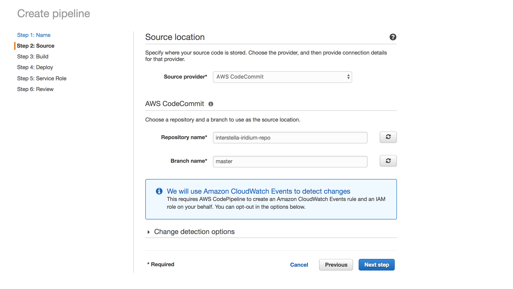

Next, configure the Build action. Choose **AWS CodeBuild** as the build provider. Click **Create a new build project** and name it `prod-iridium-service`.

Scroll down to the "Environment: How to build" section and select these values for the following fields:

- Environment Image: **Use an Image managed by AWS CodeBuild** - *There are two options. You can either use a predefined Docker container that is curated by CodeBuild, or you can upload your own if you want to customize dependencies,etc to speed up build time*
- Operating System: **Ubuntu** - *This is the OS that will run your build*
- Runtime: **Docker** - *Each image has specific versions of software installed. See [Docker Images Provided by AWS CodeBuild](http://docs.aws.amazon.com/codebuild/latest/userguide/build-env-ref-available.html)*
- Version: **aws/codebuild/docker:17.09.0** - *This will always show the latest available*

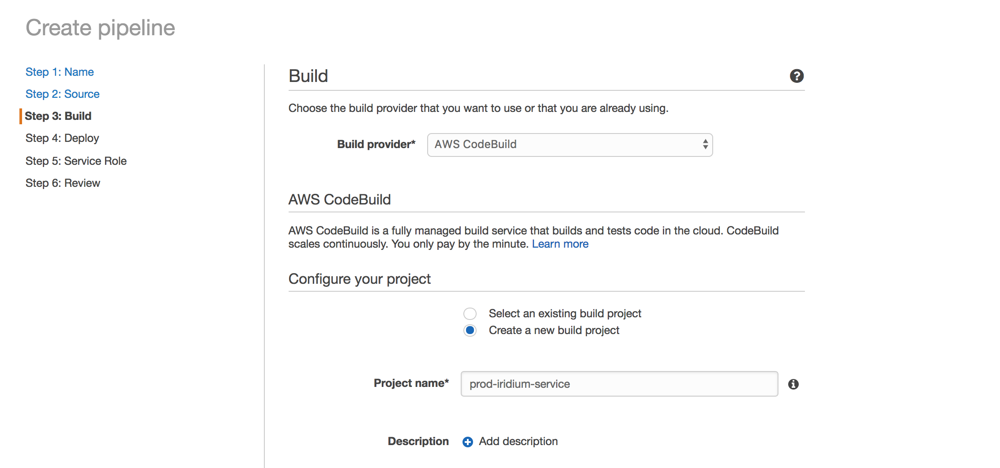

In the "AWS CodeBuild service role" section, make sure **Create a service role in your account** is selected and leave the name as default.

Scroll down to the "Advanced" section, and under "Environment Variables", set these three variables:

- Name: `AWS_ACCOUNT_ID` Value: ****Your account ID*** Type: **Plaintext** *These will look similar to the ones you configured earlier in the buildspec. Find your account number [here](https://console.aws.amazon.com/billing/home?#/account)*
- Name: `IMAGE_REPO_NAME` Value: ***Name of the iridium ECR repo*** Type: **Plaintext** *This is the name of your ECR repo for iridium*
- Name: `ENV_TYPE` Value: `prod` Type: **Plaintext** *This is a new environment variable which we're going to use to prefix our CloudWatch log stream.*

Here's what the env variables should look like. Note, your values (e.g. acct ID, EnvironmentName replaced with the one you selected) will be unique:

Once confirmed, click **Save build project** and then **Next Step**.

In the "Deploy" step, select and populate the following values:

- Deployment provider: Select **AWS CloudFormation** - *This is the mechanism we're choosing to deploy with. CodePipeline also supports several other deployment options, but we're using CloudFormation in this case.*
- Action Mode: Select **Create or Replace a Change Set** - *This will create or update an existing change set that we can apply later.*
- Stack Name: Enter `prod-iridium-service` - *Name the CloudFormation stack that you're going to create/update*
- Change Set Name: Enter `prod-iridium-service-changeset`
- Template File: Enter `service.yml` - *The filename of the template that you looked over earlier in this workshop*
- Configuration File: Enter `build.json` - *The filename of the JSON file generated by CodeBuild that has all the parameters*
- Capabilities: Select **CAPABILITY_IAM** - *Here, we're giving CloudFormation the ability to create IAM resources*
- Role Name: Select ***EnvironmentName*-CFServiceRole** - *Note, "EnvironmentName" will be the one you specified. This value is a role CloudFormation assumes to create and update stacks on your behalf*

Click **Next step**.

In the "Service Role" step, we must authorize AWS CodePipeline to access artifacts and dependencies to pull. Leave the Role Name blank and click **Create Role**. You will be automatically taken to the IAM Management Console to create a service role. Choose **Create a new IAM Role** and leave the role name as the default. Click **Allow** to create the role. Return to the AWS CodePipeline dashboard and make sure the newly created role is selected. Click **Next Step**.

Review your pipeline configuration and click **Create pipeline**.

5\. Test your pipeline.

Once the **prod-iridium-service** pipeline is created, CodePipeline will automatically try to get the most recent commit from the source and run the pipeline.

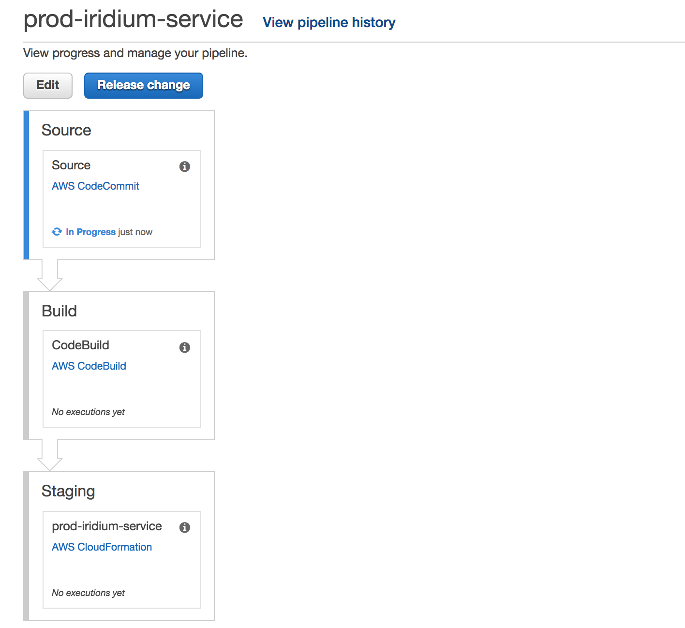

**Oh no!** There seems to have been an error that halted the pipeline. Try to troubleshoot by exploring the available links in the Build step. If you get stumped, expand the HINT below.

  

  

    HINT: CodePipeline Build stage troubleshooting
  

  From the pipeline, it's easy to see that the whole process failed at the build step. Click on <b>Details</b> to see what it will tell us. 

  Now click on <b>Link to execution details</b> since the error message didn't tell us much. 
  
  

  The link brings you to the execution details of your specific build. We can look through the logs and the different steps to find out what's wrong. In this case, it looks like the **PRE_BUILD** step failed with the following message:
  
  "Error while executing command: $(aws ecr get-login --no-include-email --region $AWS_DEFAULT_REGION). Reason: exit status 255" 

  Looking through the Build logs, you can see the following exceptions: 
  
  "AccessDeniedException: User: arn:aws:sts::123456789012:assumed-role/code-build-prod-iridium-service-service-role/AWSCodeBuild-e111c11e-b111-11c1-ac11-f1111a1f1c11 is not authorized to perform: ssm:GetParameters on resource: arn:aws:ssm:us-east-2:123456789012:parameter/interstella/iridiumTargetGroupArn status code: 400" 

  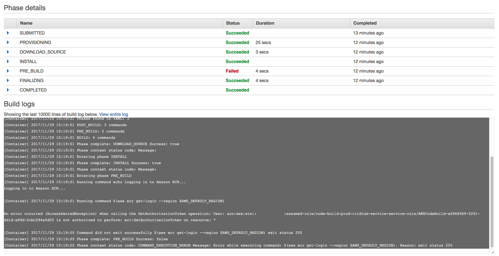

  Right, we forgot to give AWS CodeBuild the permissions to do everything it needs to do. Copy the region and account number as we'll be using those. Let's go fix it.  

  In the AWS Management Console, navigate to the [AWS IAM Roles](https://console.aws.amazon.com/iam/home#/roles) dashboard. Find the CodeBuild prod role that you created earlier. The name of the role created should be something like <b>code-build-prod-iridium-service-service-role</b>. Click <b>Add inline policy</b>. By adding an inline policy, we can keep the existing managed policy separate from what we want to manage ourselves.  

  Choose <b>Custom Policy</b>. Click <b>Select</b>. Name it <b>AccessECR</b>. In the Resource section of your policy for ssm:GetParameters, make sure you specify the region and account number so we can lock down CodeBuild's role to only access the right parameters. Enter the following policy, replacing REGION and ACCOUNTNUMBER with yours: 

<pre>
{
    "Version": "2012-10-17",
    "Statement": [
        {
            "Action": [
                "ecr:BatchCheckLayerAvailability",
                "ecr:CompleteLayerUpload",
                "ecr:GetAuthorizationToken",
                "ecr:InitiateLayerUpload",
                "ecr:PutImage",
                "ecr:UploadLayerPart"
            ],
            "Resource": "\*",
            "Effect": "Allow"
        },
        {
            "Action": [
              "ssm:GetParameters"
            ],
            "Resource": "arn:aws:ssm:<b><i>REGION</i></b>:<b><i>ACCOUNTNUMBER</i></b>:parameter/interstella/\*",
            "Effect": "Allow"
        }
    ]
}
</pre>

Choose <b>Apply Policy</b>

Once you think you've fixed the problem, since the code and pipeline haven't actually changed, we can retry the build step. Navigate back to the CodePipeline Console and choose your pipeline. Then click the **Retry** button in the Build stage.

6\. Create two more stages. One gate and one to execute the change set.

In the CodePipeline console, when you're looking at prod-iridium-service pipeline, click **Edit**. Add a stage at the bottom and name it **Approval**. Then click **+Add Action**.

In the dialog that comes up on the right, populate the following values:

- Action category: **Approval**
- Action Name: **ManualApproval**
- Approval Type: **Manual Approval**
- Leave the rest blank and click **Add action**.

Add one more stage, name it **DeployToCFN**, and create an action. In the dialog that comes out, populate the following values:

- Action category: **Deploy**
- Action Name: **DeploytoCFN**
- Deployment Provider: **AWS CloudFormation**
- Action Mode: **Execute a change set**
- Stack Name: **prod-iridium-service**
- Change set name: **prod-iridium-service-changeset**

Leave the rest as default and click **Add Action** and then **Save pipeline changes** at the top of the pipeline.

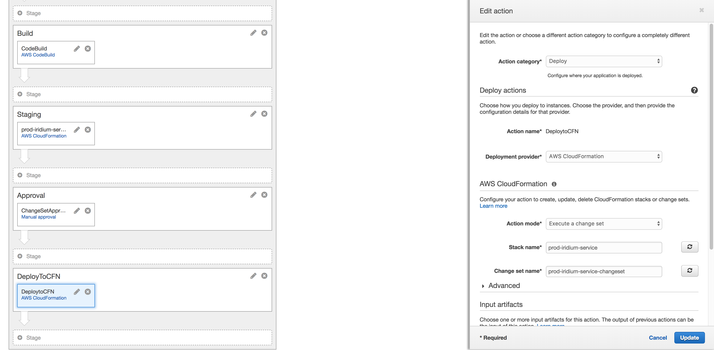

Manually release a change by clicking **Release change**. Once the pipeline goes through the stages, it will stop at the Approval stage. Now is when you would typically go and see what kind of changes will happen. We can look at CloudFormation to find out what will change. Or you can just approve the pipeline because you're a daredevil. 

Click **Review** and then put something in the comments and **Approve** the change.

7\. Now we're ready to test orders to the iridium microservice!  To do this, you will subscribe your ALB endpoint to the SNS iridium topic using the API Key Management Portal (from Workshop Setup Step 3) to start receiving orders.

Open the [API Key Management Portal](http://www.interstella.trade/getkey.html) in a new tab.  If you're not already logged in, you'll need to login with the username and password you created during the Workshop Setup.

Enter the ALB endpoint in the text field using the following format:

<pre>
http://<b><i>ALB_ENDPOINT_DNS_NAME</i></b>/iridium/
</pre>

Click on **Subscribe to Iridium topic** to start receiving orders for the iridium resource.

Once the endpoint is subscribed, you should start seeing orders come in as HTTP POST messages to the iridium log group in CloudWatch Logs.  You may notice GET requests in your log stream.  Those are the ALB health checks.  You can also check the monolith log stream to confirm 

### Checkpoint:  
At this point you have a pipeline ready to listen for changes to your repo. Once a change is checked in to your repo, CodePipeline will bring your artifact to CodeBuild to build the container and check into ECR. AWS CodePipeline will then call CloudFormation to create a change set and when you approve the change set, CodePipeline will call CloudFormation to execute the change set.

### Lab 3 - Add Security and Implement Automated Testing
Now that we've automated the deployments of our application, we want to improve the security posture of our application, so we will be automating the testing of the application as well. We've decided that as a starting point, all Interstella deployments will require a minimum of 1 test to make the changes minimal for developers. At the same time,  we will start using [IAM Roles for Tasks](http://docs.aws.amazon.com/AmazonECS/latest/developerguide/task-iam-roles.html). This allows us to specify a role per task instead of assuming the EC2 Instance Role. 

In this lab, we will use Stelligent's tool **cfn-nag**. The cfn-nag tool looks for patterns in CloudFormation templates that may indicate insecure infrastructure. Roughly speaking it will look for:

- IAM rules that are too permissive (wildcards)
- Security group rules that are too permissive (wildcards)
- Access logs that aren't enabled
- Encryption that isn't enabled

For more background on the tool, please see: [Finding Security Problems Early in the Development Process of a CloudFormation Template with "cfn-nag"](https://stelligent.com/2016/04/07/finding-security-problems-early-in-the-development-process-of-a-cloudformation-template-with-cfn-nag/)

1\. Add in IAM task roles in service.yml

Now that the microservices are really split up, we should look into how to lock them down. One great way is to use IAM Roles for Tasks. We can give a specific task an IAM role so we know exactly what task assumed what role to do something instead of relying on the default EC2 instance profile.

A complete and updated service.yml file is located in [hints/new-service.yml](https://github.com/aws-samples/amazon-ecs-interstella-workshop/blob/master/workshop3/hints/new-service.yml). Overwrite your existing service.yml with that one. 

<pre>
$ cp hints/new-service.yml service.yml
</pre>

Here are the differences:

- We added a new role to the template:

<pre>
ECSTaskRole:
  Type: AWS::IAM::Role
  Properties:
    Path: /
    AssumeRolePolicyDocument: |
      {
          "Statement": [{
              "Effect": "Allow",
              "Principal": { "Service": [ "ecs-tasks.amazonaws.com" ]},
              "Action": [ "sts:AssumeRole" ]
          }]
      }
    Policies: 
      - 
        PolicyName: "root"
        PolicyDocument: 
          Version: "2012-10-17"
          Statement: 
            - 
              Effect: "Allow"
              Action: "*"
              Resource: "*"
</pre>

- Then updated the ECS task definition to use the new role.

<pre>
TaskDefinition:
  Type: AWS::ECS::TaskDefinition
  Properties:
    Family: iridium
    ContainerDefinitions:
      - Name: iridium
        Image: !Sub ${AWS::AccountId}.dkr.ecr.${AWS::Region}.amazonaws.com/${Repository}:${Tag}
        Essential: true
        Memory: 128
        PortMappings:
          - ContainerPort: 5000
        Environment:
          - Name: Tag
            Value: !Ref Tag
        <b>TaskRoleArn: !Ref ECSTaskRole </b>
        LogConfiguration:
            LogDriver: awslogs
            Options:
              awslogs-group:
                Ref: cloudWatchLogsGroup
              awslogs-region:
                Ref: AWS::Region
              awslogs-stream-prefix: 
                Ref: CwlPrefix
</pre>

2\. Create a new stage for testing in your pipeline

Navigate to the AWS CodePipeline dashboard and choose your pipeline. Edit the pipeline and click the **+stage** button between source and the build stage. Name it **CodeAnalysis** and then click on the **+ Action** button. This will add a new stage to your pipeline where we can run some static analysis. *We want this static analysis tool to run before our Docker container even gets built so that we can fail the deployment quickly if something goes wrong.*

Select and populate the following Values:

- Action Category - **Test**
- Action Name - **CFNNag**
- Test provider - **AWS CodeBuild**
- Project Name - **EnvironmentName-CFNNagCodeBuild-project** - *We've already created a CodeBuild project for you as part of the initial CloudFormation stack. It's a Ruby stack as cfn-nag uses ruby.*
- Input Artifact #1 - **MyApp**

Click **Add Action**

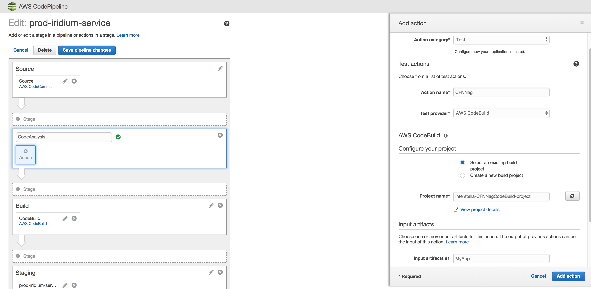

2\. Create a new yml file for the test CodeBuild project to use.

In the CloudFormation stack, we configured the CodeBuild project to look for a file named **cfn-nag-buildspec.yml**. With this, CodeBuild will install cfn-nag and then scan the service.yml CloudFormation template. It's the same format as buildspec.yml you used earlier. Take a look at the [Stelligent cfn-nag github repo](https://github.com/stelligent/cfn_nag) for how to install it. We've placed a cfn-nag-buildspec.yml.draft in the service folder for you to start. It looks like this:

<pre>
version: 0.2

phases:
  pre_build:
    commands:
      - #[TODO]: Install cfn-nag
  build:
    commands:
      - echo 'In Build'
      - #[TODO]: Scan using cfn-nag
</pre>

  

    Click here for some assistance.
  

  Within the pre-build stage, we'll want to install cfn-nag. Then we'll want to use the cfn_nag_scan command to scan the service.yml CloudFormation template. It should look like this:
  <pre>
  version: 0.2

  phases:
    pre_build:
      commands:
        - gem install cfn-nag
    build:
      commands:
        - echo 'In Build'
        - cfn_nag_scan --input-path service.yml
  </pre>
  
  A completed file is in the hints folder. It's named <a href="https://github.com/aws-samples/amazon-ecs-interstella-workshop/blob/master/workshop3/hints/hint1-cfn-nag-buildspec.yml">hint1-cfn-nag-buildspec.yml</a>
  <pre>
  $ cp hints/hint1-cfn-nag-buildspec.yml cfn-nag-buildspec.yml
  </pre>

3\. Check for access keys and secret keys being checked in.

Interstella GTC has heard a lot of people checking in their keys to repos. How can we help in the fight to secure Interstella GTC? Can you think of a way to do this? We want it to run in parallel with cfn-nag so we can have multiple tests run at the same time. How would you look through your code for anything like this and throw a warning up if something exists?

**Some hints:**

- You can run multiple actions in parallel in CodePipeline.
- AWS Access keys (as of the writing of this workshop) are alphanumeric and 20 characters long. 
- Secret keys can contain some special characters and are 40 characters long. 
- There is a second CodeBuild project already created for you using ubuntu-base:14.04 (Just vanilla linux) looking for accesskeys-buildspec.yml

  

    Click here for an answer that we've come up with.
  

  First, edit the CodeAnalysis stage of your pipeline so you can add another action right next to the CFNNag. Select and populate the following Values

  - Action Category - **Test** 
  - Action Name - **CheckAccessKeys** 
  - Test provider - **AWS CodeBuild** 
  - Project Name - **EnvironmentName-GeneralCodeBuild-project** - *We've already created a CodeBuild project for you as part of the initial CloudFormation stack. It's a Generic Ubuntu 14.04 Linux stack.* 
  - Input Artifact #1 - **MyApp**
  
  Click **Add Action**
  
  
  
  We've pre-written a script for you to look for an AWS Access Key or Secret Key within your code. Take a look in github for the [checkaccesskeys.sh script in GitHub](https://github.com/aws-samples/amazon-ecs-interstella-workshop/blob/master/workshop3/tests/checkaccesskeys.sh). If it finds something, it will output some warnings to the CodeBuild log output. Normally, we would fire off some sort of security notification, but this will do for now. Let's make it executable:
  <pre>
  $ chmod +x tests/checkaccesskeys.sh
  </pre>

  Within the build section, add in a line to run a script in the test folder. Your accesskeys-buildspec.yml should now look like this:

  <pre>
  version: 0.2

  phases:
    build:
      commands:
        - ./tests/checkaccesskeys.sh
  </pre>

  A final version of this buildspec is also located in the hints folder. It's named accesskeys-buildspec.yml.

4\. Let's check everything in and run the tests. 

<pre>
$ git add -A
$ git commit -m "Adding in buildspec for cfn-nag AND check for access key scans"
$ git push origin master
</pre>

By pushing to CodeCommit, the pipeline will automatically trigger. 

5\. Fix all the errors.

WHAT? THERE WERE ERRORS AGAIN?!?!? Ok go through and fix them all. 

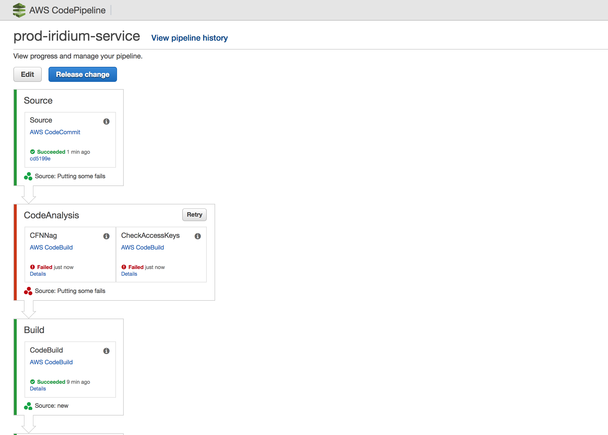

Look at the outputs of both CodeBuild runs and you'll see the errors. Go through and remediate them all.

How to fix CFNNag errors:

The error is this:

The permissions for my role ECSTaskRole are too wide open. Let's lock it down. Update the IAM policy to only allow access to your SSM parameters. The answer is in [hints/final-service.yml](https://github.com/aws-samples/amazon-ecs-interstella-workshop/blob/master/workshop-cicd/hints/final-service.yml)

<pre>
$ cp hints/final-service.yml service.yml
</pre>

How to fix CheckAccessKeys errors:

The build output will tell you exactly what file and what line the problems are on. Open the files and delete the lines specified.

Check everything in again:

<pre>
$ git add -A
$ git commit -m "Locked down IAM roles for service.yml and removed hard coded credentials"
$ git push origin master
</pre>

### Troubleshooting
#### Common Errors:
<pre>
[Container] 2017/11/30 10:05:29 Running command docker build -t $IMAGE_REPO_NAME:$CODEBUILD_SOURCE_VERSION .
invalid argument "interstella-iridium:arn:aws:s3:::codepipeline-eu-central-1-311881684539/prod-iridium-service/MyApp/JrWYRbf" for t: Error parsing reference: "interstella-iridium:arn:aws:s3:::codepipeline-eu-central-1-311881684539/prod-iridium-service/MyApp/JrWYRbf" is not a valid repository/tag
See 'docker build --help'.

[Container] 2017/11/30 10:05:29 Command did not exit successfully docker build -t $IMAGE_REPO_NAME:$CODEBUILD_SOURCE_VERSION . exit status 1
[Container] 2017/11/30 10:05:29 Phase complete: BUILD Success: false
[Container] 2017/11/30 10:05:29 Phase context status code: COMMAND_EXECUTION_ERROR Message: Error while executing command: docker build -t $IMAGE_REPO_NAME:$CODEBUILD_SOURCE_VERSION .. Reason: exit status 1
[Container] 2017/11/30 10:05:29 Entering phase POST_BUILD
[Container] 2017/11/30 10:05:29 Running command echo Build completed on `date`
Build completed on Thu Nov 30 10:05:29 UTC 2017
</pre>

You probably didn't check into master. This happens if the new buildspec.yml is not in the master branch.

### Workshop Cleanup

This is really important because if you leave stuff running in your account, it will continue to generate charges.  Certain things were created by CloudFormation and certain things were created manually throughout the workshop.  Follow the steps below to make sure you clean up properly.  

1. Delete any manually created resources throughout the labs, e.g. CodePipeline Pipelines and CodeBuild projects.  Certain things like task definitions do not have a cost associated, so you don't have to worry about that.  If you're not sure what has a cost, you can always look it up on our website.  All of our pricing is publicly available, or feel free to ask one of the workshop attendants when you're done.
2. Go to the CodePipeline console and delete prod-iridium-service. Hit Edit and then Delete.
3. Delete any container images stored in ECR, delete CloudWatch logs groups, and delete ALBs and target groups (if you got to the bonus lab)
4. In your ECS Cluster, edit all services to have 0 tasks and delete all services
5. Delete log groups in CloudWatch Logs
6. Delete the CloudFormation stack prod-iridium-service that CodePipeline created.
7. Finally, delete the CloudFormation stack launched at the beginning of the workshop to clean up the rest.  If the stack deletion process encountered errors, look at the Events tab in the CloudFormation dashboard, and you'll see what steps failed.  It might just be a case where you need to clean up a manually created asset that is tied to a resource goverened by CloudFormation.

